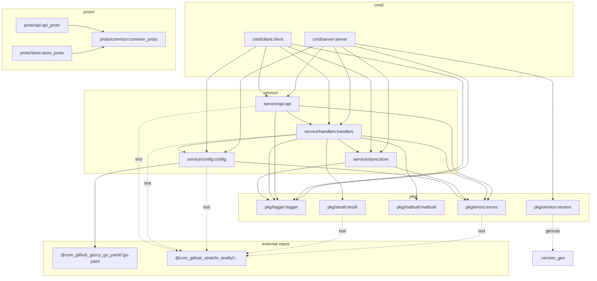

# bazel-fixture

A deliberately non-trivial Bazel repository used as a stable fixture for testing [tango](https://github.com/uber/tango).

Tango computes and compares Bazel target graphs across revisions of a repository. To test tango against a real graph without depending on tango's own source layout, this repository provides:

- A layered Go application (`cmd/` → `service/` → `pkg/`) with multiple internal edges.
- External Go-module dependencies via `rules_go` / `gazelle` (`@com_github_goccy_go_yaml`, `@com_github_stretchr_testify`), so the `@repo` → `//external:repo` translation path is exercised.
- Embedded resources (`embedsrcs`) in both JSON (`pkg/strutil/replacements.json`, `service/config/defaults.json`) and YAML (`service/config/config.yaml`).
- A `genrule` (`//pkg/version:version_gen`) whose output is compiled into a `go_library`.
- A three-package `proto_library` graph (`//proto/common`, `//proto/api`, `//proto/store`) with cross-package proto imports.
- `go_test` targets that reference external dependencies.

## Repository layout

```
.
├── MODULE.bazel                # rules_go 0.57 + gazelle 0.45 + rules_proto 7.1 + protobuf 31.1
├── .bazelversion               # 8.4.1
├── go.mod                      # goccy/go-yaml, stretchr/testify
├── tools/bazel                 # thin shell wrapper → bazelisk on PATH
├── cmd/
│   ├── server/                 # go_binary root: server
│   └── client/                 # go_binary root: client
├── service/
│   ├── api/                    # facade over handlers
│   ├── handlers/               # business logic wiring
│   ├── store/                  # in-memory record store
│   └── config/                 # embeds YAML + JSON, uses @com_github_goccy_go_yaml
├── pkg/
│   ├── logger/                 # leaf: leveled logger
│   ├── errors/                 # leaf: typed error, uses testify in its test
│   ├── mathutil/               # leaf: numeric helpers, has go_test
│   ├── strutil/                # embeds replacements.json
│   └── version/                # genrule produces version_gen.go, embedded into go_library
└── proto/
    ├── common/                 # proto_library (leaf)
    ├── api/                    # proto_library depending on common
    └── store/                  # proto_library depending on common
```

## Dependency graph



Solid arrows are `deps`. Dotted `test` arrows are `go_test` deps. `pkg/version` also has a `genrule` (`:version_gen`) whose output is a source of `:version`.

## Requirements

- [bazelisk](https://github.com/bazelbuild/bazelisk) on your `PATH` (`brew install bazelisk`, `npm i -g @bazel/bazelisk`, or `go install github.com/bazelbuild/bazelisk@latest`). Bazelisk reads [.bazelversion](.bazelversion) and downloads the pinned Bazel release on first run.
- Go 1.25+ for `go mod tidy` (not required to run bazel queries).

`tools/bazel` is a small shell wrapper that just `exec`s `bazelisk`, so `./tools/bazel …` and `bazelisk …` are interchangeable.

## Query the graph

```bash
bazelisk query //...
bazelisk query 'deps(//cmd/server:server)'
bazelisk query 'deps(//...:all-targets)' --output=streamed_proto > /tmp/graph.proto
```

The last command is (approximately) what tango's native graph runner issues.

## Notes for tango integration

- Every `go_library`, `go_binary`, and `go_test` is hand-written (no gazelle-generated BUILD files) so the target set is stable across commits unless a BUILD file is edited directly.
- The graph is small enough (~30 targets) for assertions to enumerate expected changed-target sets.
- Adding a source file to a package requires only editing the corresponding `BUILD.bazel` — the graph shape is fully explicit.
